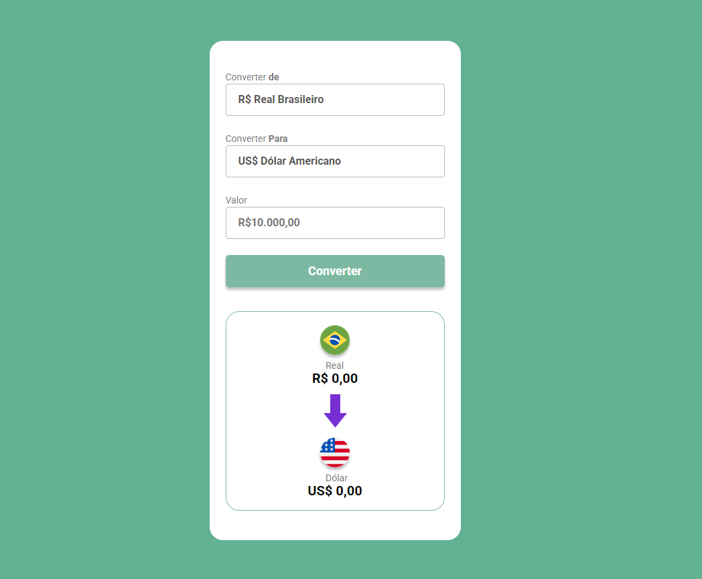

<h1 align="center">conversor de moedas</h1>
 
<h3> Esse foi um projeto que eu aprendi no <a href="https://www.devclub.com.br">Dev Club</a></h3>
 
<h2>🚀 Tecnologias Utilizadas</h2>
 
<h3>Este projeto foi desenvolvido com as seguintes tecnologias: </h3>

HTML
 
CSS
 
Java Script

<h3>Desktop/Mobile: </h3>
<<<<<<< HEAD

=======

>>>>>>> 757c5dc1f01c014adb61833eafc4e6bc8924341f
